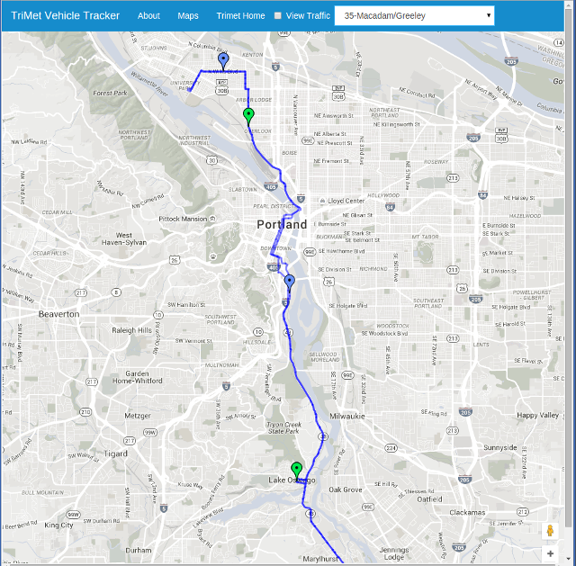

# TriMet Vehicle Tracker

This is the capstone project for the PDX Code Guild Sept 2015 - Jan 2016 Class. The purpose of this app is to provide a simple visual interface for anyone who ever wondered if they could see a route map combined with realtime vehicle positions and stop information, all in one place.

The utilizes the TriMet vehicle positions API and Stop ETA API for vehicle postions/ETA to stops, and displays this information using the Google Maps API.

## Developer/App keys 

This app requires two APPIDs/Keys to run: 
    * TriMet API Key
    * Google Maps (Javascript) API Key

See http://developer.trimet.org/ and https://developers.google.com/maps/documentation/javascript/ for more information. 

## Usage
The app is simple to use: Use the dropdown box to select the desired MAX/Portland Streetcar/TriMet Bus, and the map will display routes and vehicle positions (if that route is currently in service.) 

Vehicles are color-coded to corresponding stops: Green with Green and Blue with Blue. Green travels in the opposite direction to Blue. 

Zooming in beyond a certain threshold will enable stops to be displayed. Clicking on a desired stop will reveal the Vehicle IDs and Estimated Time to Arrivals (ETA) of these vehicles.  

## Known Issues
Not all TriMet vehicles broadcast their geolocations. Fortunately, this seems to 
be limited to (and consistent for) Portland StreetCar, WES Commuter Rail, and 
the Portland Aerial Tram.  However, for these vehicles, it is still possible to 
zoom into and click on individual stops to see the ETA times for the next vehicles.
In other words, no location markers will be displayed, but the ETA arrivals are 
still available. 

Occasionally, vehicles will return a null Vehicle ID. As of this release, this  
issue has not been dealt with. In such cases, upcoming vehicles may show as blank
spaces, with ETA times rendered as NaN:NaN.

### Notes for Thunder
I attempted a refactoring push over the Christmas holiday, per your suggestions. 
I am especially proud of /routeserver/models.py, which now makes use of 
python/django inheritance principles.  Please also take an extended look at
/routeserver/static/bootstrap/js/gmapScript.js (the main google maps script) and
/routeserver/static/bootstrap/js/trimetFuncs.js, which represent my main TriMet
API calls.  I tried to make use of namespacing/hoisting principles. 

-KS